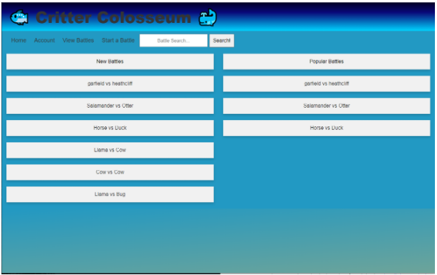
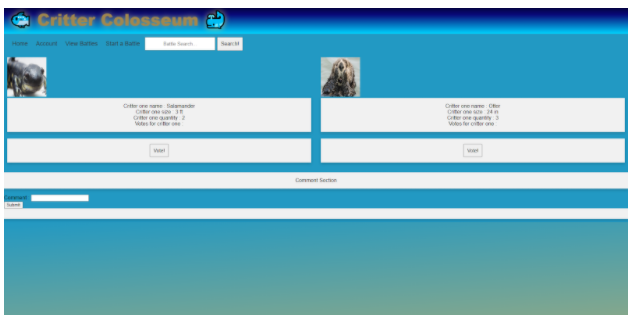
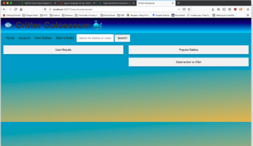
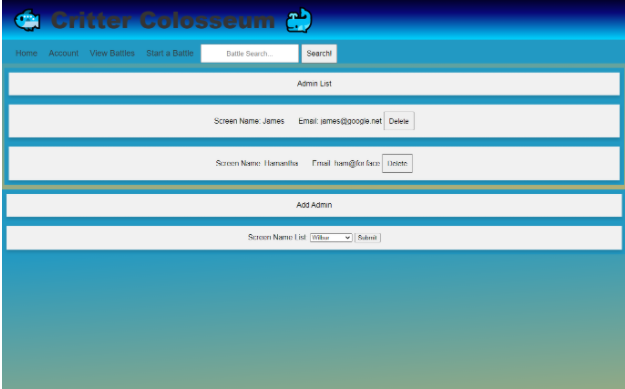
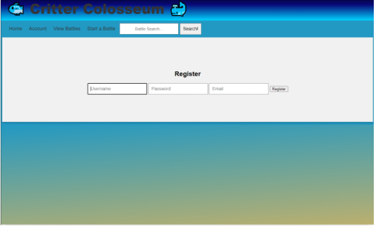

# Critter Colosseum
1. A basic web application that allows users to register and post battles of animals. 
2. Has admin capabilities where the admin can delete users.
3. Each user can only vote for a battle once.
4. A user can make a comment on a battle and upvote other comments.
5. Uses a SQL database to store user information and animal information.

## Display of the Home page

## Battle page 

## Battle page 

## User overview page

## Registration page 

